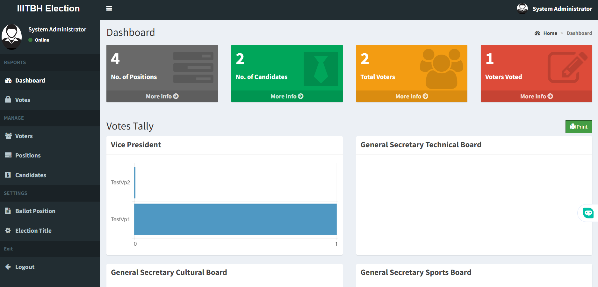

# 🗳️ Election Portal for IIIT Bhagalpur

This **Election Portal** is a secure, robust online voting platform developed specifically for **IIIT Bhagalpur**. The portal provides a streamlined and transparent system to manage elections, allowing administrators to oversee the entire voting process while enabling verified voters to cast their votes electronically. This project integrates a user-friendly admin interface, and automatic vote counting to enhance the overall election experience.

## 🌟 Key Features

- **Secure User Authentication**: Utilizes email-based registration for voter account security.
- **Comprehensive Admin Dashboard**: Allows administrators to set up elections, create positions, add candidates, monitor voting, and view results in real-time.
- **Candidate Management**: Administrators can add and manage candidates for each election position.
- **Efficient Voting Mechanism**: Ensures that each verified user can only cast a single vote for each position.
- **Automatic Vote Tallying**: Instantaneous and transparent vote counting and result display.
- **User-Friendly Interface**: Intuitive UI design with responsive elements for seamless navigation.

---

## 📁 Project Structure

Here's an overview of the primary components of the project:

- **account/**: Manages custom user models, authentication logic.
- **core/**: Contains core election functionalities, such as Voter, Position, Candidate, and Voting models.
- **templates/**: HTML files for the UI, including login, dashboard, voting page, and results page.
- **static/**: CSS, JavaScript, and image resources to style and enhance user interaction.

Each module in the project is organized to separate concerns, making it easy to manage, scale, and customize for similar election systems.

---

## 🛠️ Technology Stack

This project uses a modern and secure technology stack, ideal for building dynamic, data-driven applications:

- **Backend**: Django (Python)
- **Frontend**: HTML, CSS (Bootstrap framework), JavaScript
- **Database**: SQLite (Default for Django, but can be switched to PostgreSQL or MySQL as needed)
- **Hosting**: Deployment-ready for platforms supporting Django (e.g., PythonAnywhere)

---

## 🚀 Getting Started

To set up this project locally, follow these instructions:

### Prerequisites

- **Python 3.7+**: Make sure Python is installed on your machine.
- **Virtual Environment**: For dependency isolation, it’s recommended to use a virtual environment.

### Installation

1. **Clone the Repository**:
   ```bash
   git clone https://github.com/Siddharth-Nama/ElectionPortal_IIITBH.git
   cd ElectionPortal_IIITBH
   ```

2. **Create a Virtual Environment**:
   ```bash
   python -m venv myenv
   source myenv/bin/activate  # macOS/Linux
   myenv\Scripts\activate     # Windows
   ```

3. **Install Dependencies**:
   ```bash
   pip install -r requirements.txt
   ```

4. **Run Database Migrations**:
   ```bash
   python manage.py migrate
   ```

5. **Create a Superuser Account**:
   ```bash
   python manage.py createsuperuser
   ```

6. **Start the Development Server**:
   ```bash
   python manage.py runserver
   ```

   The application will be accessible at `http://127.0.0.1:8000`.

---

## 📚 Usage Guide

### Admin Operations

1. **Login**: Admin users can access the admin panel via `/admin`.
2. **Manage Elections**:
   - **Create Positions**: Add various positions (e.g., President, Vice President) with voting limits.
   - **Add Candidates**: Assign candidates to each position with names, bios, and photos.
3. **Monitor Voting**: Track voters, voting activity, and manage any issues.
4. **View Results**: Real-time results are accessible, showing vote counts per candidate for each position.

### Voter Operations

1. **Register and Verify**:
   - Sign up with email and basic details.
2. **Log In and Vote**:
   - Verified users log in and can vote for candidates in each election position.
3. **Confirm Vote**: Once a vote is cast, it is recorded and cannot be altered.

---

## 📸 Screenshots

### Login Page


### Voting Page


### Admin Dashboard


---

## 🚀 Deployment Guide

To deploy this project on a production server, make sure to:

1. **Set DEBUG=False**: Disable debug mode in production.
2. **Set Up a Strong SECRET_KEY**: Use a secure, unpredictable secret key.
4. **Database Setup**: Configure a reliable production database like PostgreSQL.
5. **Static Files**: Run `python manage.py collectstatic` to gather all static files.

---

## 🤝 Contributing

Contributions are welcome to improve functionality, fix bugs, or enhance documentation. To contribute:

1. **Fork the Repository**
2. **Create a New Branch**: `git checkout -b feature/your-feature-name`
3. **Commit Your Changes**: `git commit -m 'Add some feature'`
4. **Push to Branch**: `git push origin feature/your-feature-name`
5. **Open a Pull Request**

---

## 📜 License

This project is licensed under the MIT License. Please refer to the `LICENSE` file for more details.

---

## 👥 Developed By

Originally developed by Owonubi Job Sunday. 
Customized and enhanced with new features for IIIT Bhagalpur by the ElectionPortalTeam.

